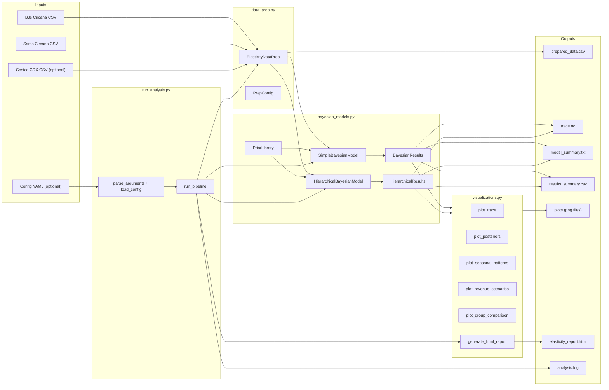
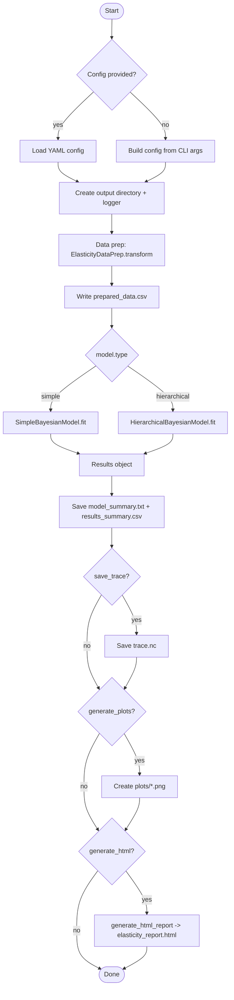
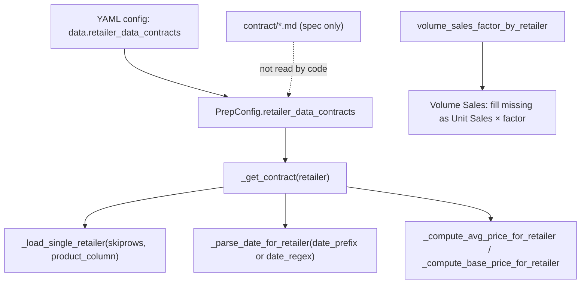
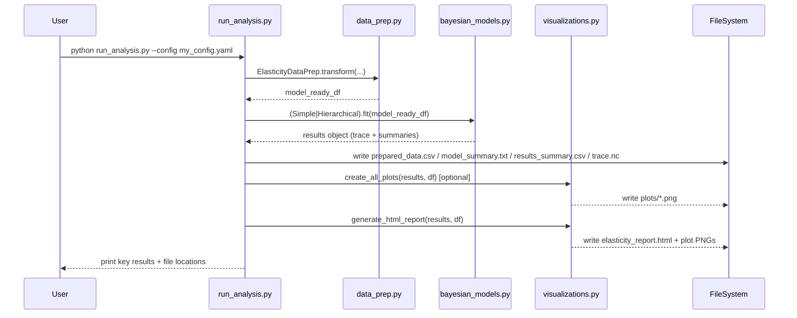

# Architecture: Bayesian Price Elasticity Analysis System

This document explains **how the repository’s code fits together**, how data flows from input files to results, and which classes/functions call each other.

It is intentionally verbose: the goal is for a new contributor (or stakeholder) to understand the system end-to-end.

---

## 1) What the system does (one paragraph)

Given weekly **Circana** CSV exports for one or more retailers (e.g., BJ’s, Sam’s Club, Costco), the system:

1. **Transforms** those raw files into a model-ready weekly dataset (wide format, log transforms, seasonality, promo intensity, time trend, and feature-availability flags)
2. **Fits** either a **simple** (pooled) Bayesian log-log demand model or a **hierarchical** (partial pooling) Bayesian model using **PyMC**
3. **Summarizes** posterior distributions into elasticities + credible intervals + convergence diagnostics
4. **Produces deliverables**: plots + a **standalone HTML report** suitable for non-technical stakeholders

---

## 2) Repository map (what lives where)

**Core modules**

- `data_prep.py`
  - Owns the **data transformation pipeline** from raw Circana CSV → modeling table (`pd.DataFrame`)
  - Provides helper methods to add engineered features (interactions, lags, moving averages, custom formulas)
- `bayesian_models.py`
  - Owns the **Bayesian model definitions** (simple + hierarchical)
  - Owns priors, sampling, convergence diagnostics, and a results API
- `visualizations.py`
  - Owns plotting (trace/posterior/seasonal/revenue/group comparison) + **HTML report generation**
- `run_analysis.py`
  - A **CLI orchestration layer**: config parsing → data prep → model fit → save artifacts → plots → HTML report

**Docs**

- `README.md`: quickstart + examples
- `contract/PROJECT_CONTRACT.md`: detailed blueprint/spec, deliverables, validation plan
- `help_documents/architecture.md` (this file): “how everything connects”
- `help_documents/`: narrative guides and operational runbooks
  - `how_to_run.md`: step-by-step commands to set up venv, upload data, run the pipeline, and validate outputs
  - `Sparkling_Ice_Analytics_Plan_Business_Guide.md`: business story and decision framing
  - `Sparkling_Ice_Analytics_Plan_Techno_Functional_Guide.md`: combined business + technical deep dive (data contract, model form, implementation pointers)
  - `Azure_VM_Cursor_MCMC_Setup_Guide.md`: VM setup and running guidance

**Scripts / automation**

- `scripts/setup_venv_py312_windows.ps1`, `scripts/setup_venv_py312_linux.sh`: create a Python 3.12 venv and install dependencies
- `scripts/convert_help_md_to_html.ps1`, `scripts/convert_help_md_to_html.sh`: export a `help_documents/*.md` file to `html/*.html`
- `scripts/md_to_html.py`: shared Markdown → HTML converter used by both wrappers

**Examples**

- `examples/example_01_simple.py`: simple/pooled workflow
- `examples/example_02_hierarchical.py`: hierarchical workflow
- `examples/example_03_add_features.py`: feature engineering patterns + notes on model extension
- `examples/example_04_costco.py`: retailer with missing features (illustrative missing-promo workflow)
- `examples/example_05_base_vs_promo.py`: base vs promo dual-elasticity showcase

---

## 3) High-level architecture (components + dependencies)

### Component diagram (module dependency graph)



**Key idea:** `run_analysis.py` is the “conductor”. It doesn’t implement business logic; it composes the other modules.

---

## 4) End-to-end flow (what happens when you run the pipeline)

### Flowchart: `python run_analysis.py ...`



---

## 5) Detailed call graph (who calls what)

### Library usage (Python import style)

Typical “import-and-call” usage is:

1. Call `ElasticityDataPrep.transform(...)` to create a model-ready DataFrame
2. Call `SimpleBayesianModel.fit(df)` or `HierarchicalBayesianModel.fit(df)` to fit a Bayesian model
3. Call `generate_html_report(results, data=df, ...)` to generate outputs

### CLI usage

The CLI wraps that same flow:

- `run_analysis.py:main()` → `run_analysis.py:run_pipeline(config, logger)` which internally calls:
  - `ElasticityDataPrep.transform(...)`
  - `SimpleBayesianModel.fit(...)` **or** `HierarchicalBayesianModel.fit(...)`
  - `visualizations.create_all_plots(...)` (optional)
  - `visualizations.generate_html_report(...)` (optional)

---

## 6) Data contracts

### 6.1 Input contracts: per-retailer CSV expectations

The data prep layer supports heterogeneous retailer sources (Circana, Costco CRX, etc.) using a YAML-driven `retailer_data_contracts` block in `config_template.yaml`.

#### 6.1.1 “Contract” in code vs “contract” in docs (important)

In this repo, the word “contract” is used in two different ways:

- **Runtime contract (used by code)**: a Python dict stored on `PrepConfig.retailer_data_contracts` (typically loaded from YAML via `run_analysis.py --config ...`).  
  `data_prep.py` calls `_get_contract(retailer)` and uses the returned dict to decide how to read and interpret each retailer’s CSV.
- **Spec contract (docs only)**: Markdown files under `contract/` (e.g., `contract/Costco_Data_Integration_Contract.md`).  
  These are human-readable mapping specs and rationale. The code does **not** parse these files.

This distinction matters because Costco’s schema differences are handled by the **runtime** YAML contracts, not the Markdown spec.

#### 6.1.2 How the runtime contract drives Costco (and other retailers)

Retailer inclusion rule:

- BJ’s and Sam’s are always loaded (they are required inputs).
- Costco is loaded **only if** a `costco_path` is provided:
  - CLI mode: `python run_analysis.py --costco data/costco.csv ...`
  - Config mode: `data.costco_path: "data/costco.csv"`

When `retailer_data_contracts` is provided, it drives retailer-specific behavior like:

- header handling (`skiprows`)
- product identifier column name (`Product` vs `Item`) and renaming to `Product`
- date parsing (`date_prefix` strip vs `date_regex` extraction)
- average price calculation (formula vs direct column, e.g., Costco `Avg Net Price`)
- base price calculation (formula + fallback threshold)
- whether `Volume Sales` exists directly or must be computed

Two other “contract-like” inputs are also critical for heterogeneous retailers:

- **Volume sales strict rule**: the dependent variable is always **Volume Sales**. If a retailer file is missing a `Volume Sales` column (common for Costco), `data_prep.py` computes it as:
  - `Volume Sales = Unit Sales × volume_sales_factor_by_retailer[Retailer]`
- **Missing-feature masking**: `PrepConfig.retailers` can specify `has_promo` and `has_competitor`.  
  `data_prep.py` uses these to zero-out promo or competitor features for retailers that don’t have them, so one model can run across mixed retailers.

#### 6.1.3 Flow: YAML contract → `PrepConfig` → data prep behavior



Where to find operational steps (commands, venv, uploading CSVs, validating outputs):

- `help_documents/how_to_run.md`
- `help_documents/Azure_VM_Cursor_MCMC_Setup_Guide.md`

If `retailer_data_contracts` is provided, `ElasticityDataPrep` uses it to drive:
- header handling (`skiprows`)
- product identifier column name (`Product` vs `Item`)
- date parsing (prefix strip vs regex extract)
- average price calculation (formula vs direct column, e.g., Costco `Avg Net Price`)
- base price calculation (formula + fallback threshold)
- whether a direct `Volume Sales` column exists or needs computation via `volume_sales_factor_by_retailer`

If contracts are not provided, the pipeline falls back to legacy Circana defaults.

#### Circana-style (BJ’s / Sam’s) expectations

`ElasticityDataPrep._load_data()` reads Circana CSVs with `skiprows=2`. The pipeline expects typical Circana-style columns:

- `Time` (e.g., `"Week Ending 01-05-25"`)
- `Product` (string; used to filter Sparkling Ice vs Private Label)
- `Dollar Sales`
- `Unit Sales`
- Promo columns (optional; used if `include_promotions=True` and they exist):
  - `Unit Sales Any Merch`
  - `Unit Sales Feature Only`
  - `Unit Sales Display Only`
  - `Unit Sales Feature and Display`

If promo columns don’t exist in a retailer file, the code sets `Promo_Intensity` to `0.0` for those rows.

#### Costco CRX expectations (high level)

Costco uses a different schema (CRX extract). The contract typically configures:
- `skiprows=1`
- `product_column="Item"` (renamed to `Product` internally)
- `brand_filter="sparkling ice core"` (to select the brand aggregate, not the individual UPC lines)
- average price paid from `Avg Net Price` (direct column)
- base price from `Non Promoted Dollars / Non Promoted Units` with fallback to `Average Price per Unit` when non-promoted units are too small
- no private label rows → `has_competitor=0` (cross-price term masked out)

**Dual-elasticity inputs (recommended when available)**

If your Circana extracts include base-sales fields, the pipeline can compute a cleaner “strategic vs tactical” split:

- `Base Dollar Sales`, `Base Unit Sales` → used to compute **Base Price**
- `Dollar Sales`, `Unit Sales` → used to compute **Average Paid Price** (Circana). For Costco CRX, the contract typically uses `Avg Net Price`.
- `Promo_Depth_SI = (AvgPrice / BasePrice) - 1` → a single “promo depth” feature (negative when discounted)

### 6.2 Output contract: “model-ready” DataFrame schema

`ElasticityDataPrep.transform()` returns a DataFrame with **one row per week** (and per retailer, if `retailer_filter='All'`).

Common columns:

- `Date` (weekly date)
- `Volume_Sales_SI`, `Volume_Sales_PL` (normalized quantity; dependent variable uses Sparkling Ice volume)
- `Price_SI`, `Price_PL`
- `Log_Volume_Sales_SI`
- `Log_Price_SI`, `Log_Price_PL`
- `Promo_Depth_SI` (preferred when base sales fields are present and `separate_base_promo=True`)
- `Promo_Intensity_SI` (fallback when base sales fields are not available)
- `Week_Number` (if time trend enabled)
- `Spring`, `Summer`, `Fall` (if seasonality enabled)

Multi-retailer columns (when `retailer_filter='All'`):

- `Retailer` (string)

Missing-feature flags (when a retailer config is provided via `PrepConfig.retailers`):

- `has_promo` ∈ {0,1}
- `has_competitor` ∈ {0,1}

---

## 7) Modeling layer: what’s being estimated (and how it maps to code)

### 7.1 Simple model (pooled)

At a high level the simple model is:

\[
\log(\text{Sales}_{t}) = \alpha
 + \beta_{\text{own}} \log(\text{Price}_{SI,t})
 + \beta_{\text{cross}} \log(\text{Price}_{PL,t})
 + \beta_{\text{promo}} \cdot \text{Promo}_{t}
 + \beta_{\text{season}} \cdot \text{SeasonDummies}_{t}
 + \beta_{\text{time}} \cdot \text{WeekNumber}_{t}
 + \epsilon_t
\]

In code this is implemented in `SimpleBayesianModel._build_model()` using PyMC random variables for each \(\beta\).

### 7.2 Hierarchical model (partial pooling across retailers)

The hierarchical model makes **own-price elasticity retailer-specific**, with a global prior:

\[
\mu_{\text{global}} \sim \mathcal{N}(\mu_0, \sigma_0)
\]
\[
\sigma_{\text{group}} \sim \text{HalfNormal}(\cdot)
\]
\[
\beta_{\text{own},r} \sim \mathcal{N}(\mu_{\text{global}}, \sigma_{\text{group}})
\]

Then each observation uses \(\beta_{\text{own},r}\) (and a retailer-specific intercept) for its linear predictor.

In code this is implemented in `HierarchicalBayesianModel._build_model()` with:

- `mu_global_own`
- `sigma_group_own`
- `elasticity_own` as a vector with `shape=n_groups`

### 7.3 Priors

`PriorLibrary.get_priors('default'|'informative'|'vague')` returns a dict of prior parameters used by both models.

---

## 8) Missing features (Costco) — how it works now

### Problem

Some retailers might lack a feature:

- **Costco** typically has promo fields (CRX non-promoted vs promoted splits), but has **no Private Label / competitor series** → cross-price cannot be computed.
- Some retailers might not have a valid competitor series (cross-price).

If you put `NaN` directly into the model matrix, PyMC sampling breaks (the log-likelihood becomes NaN).

### Solution: “availability flags + masking”

The system uses two mechanisms together:

1. In `data_prep.py`, when a retailer is configured as missing a feature, the numeric column is set to a **safe default** (0.0) and an availability flag is set:
   - missing promo → `Promo_Depth_SI = 0.0` / `Promo_Intensity_SI = 0.0` and `has_promo = 0`
   - missing competitor → `Log_Price_PL = 0.0` and `has_competitor = 0`

2. In `bayesian_models.py`, the linear predictor multiplies those feature columns by the flags:
   - promo contribution is: `beta_promo * (Promo * has_promo)` where `Promo` is `Promo_Depth_SI` when present, else `Promo_Intensity_SI`
   - cross-price contribution is: `elasticity_cross * (Log_Price_PL * has_competitor)`

So for Costco rows where `has_competitor = 0`, the cross-price term is exactly 0 and **does not influence the likelihood**—but the rest of the model still uses Costco’s own-price and promo variation (when present) to estimate elasticities, and hierarchical pooling shares information across retailers.

### Why this is statistically reasonable

The system is explicitly stating:

- “Promo is unobserved (or structurally absent) for this retailer” → we do not attempt to infer promo effects from noise.
- “Cross-price is unobserved” → we do not attribute changes to competitor pricing where there is no competitor series.

This avoids both:

- throwing away the entire retailer (losing signal), and
- naive imputation that would bias parameters.

---

## 9) Results API (how downstream code consumes model output)

Both `BayesianResults` and `HierarchicalResults` expose:

- **Posterior summaries**: `results.elasticity_own` (mean/median/std/95% CI)
- **Diagnostics**: `results.converged`, `results.rhat_max`, `results.ess_min`, `results.n_divergences`
- **Bayesian queries**:
  - `results.probability("elasticity_own < -2.0")`
  - `results.revenue_impact(price_change_pct=-3)`

Hierarchical adds:

- `results.global_elasticity`
- `results.group_elasticities` (dict by retailer)
- `results.compare_groups(group1, group2)`

These are the objects that `visualizations.py` consumes to create plots and the HTML report.

---

## 10) Visualization and report generation

The report generator `generate_html_report(results, data, output_dir, report_name)`:

1. Generates plots (PNG) using `plot_trace`, `plot_posteriors`, `plot_seasonal_patterns`, `plot_revenue_scenarios`, and optionally `plot_group_comparison`
2. Builds a self-contained HTML file with embedded plot references and summary tables

### Sequence diagram: report generation



---

## 11) Extension points (how you evolve the system)

### Add a new retailer

- Provide an additional CSV path to `ElasticityDataPrep.transform(...)`
- Ensure `Retailer` labels are consistent
- If a retailer is missing promo/competitor, add an entry under `PrepConfig.retailers`:

```yaml
data:
  retailers:
    NewRetailer:
      has_promo: false
      has_competitor: true
```

### Add new engineered features (data only)

Use methods on `ElasticityDataPrep`:

- `add_interaction_term`
- `add_lagged_feature`
- `add_moving_average`
- `add_custom_feature`

### Add new engineered features (modeling)

If you want the model to *use* new features, you extend the model’s `_build_model()` to add:

- a new coefficient prior, e.g. `beta_new = pm.Normal('beta_new', mu=0, sigma=0.2)`
- a new term in `mu`, e.g. `mu += beta_new * data['NewFeature'].values`

This is called out explicitly in `examples/example_03_add_features.py`.

---

## 12) “Where should I start reading code?”

Recommended reading order:

1. `run_analysis.py` → to see the orchestration
2. `data_prep.py` → to understand the data contract and features
3. `bayesian_models.py` → to see what’s actually estimated and how posteriors are summarized
4. `visualizations.py` → to see the stakeholder outputs
5. `examples/` → runnable demonstrations of common workflows

